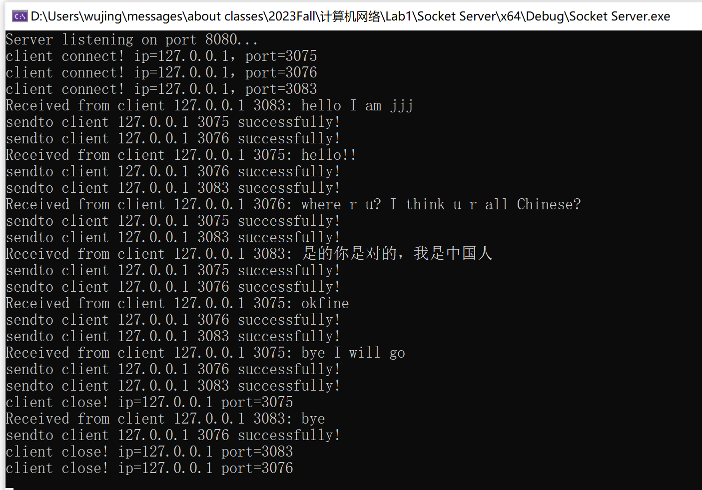
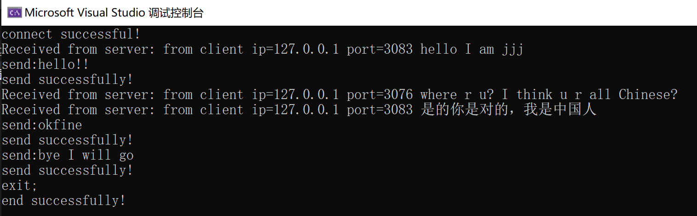
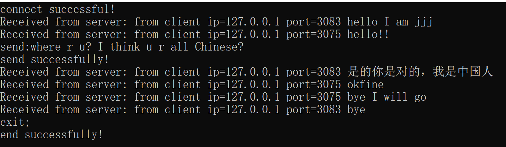
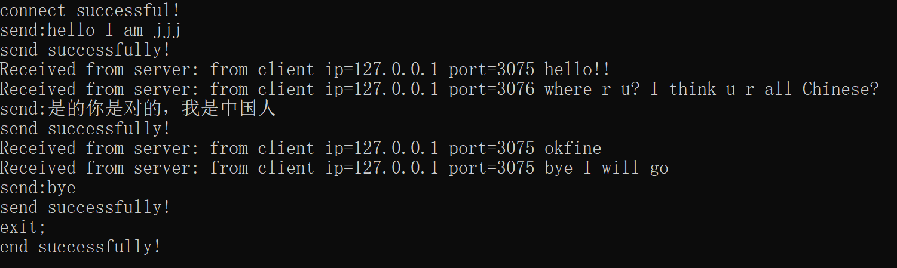

<h1><center>lab1实验报告</center></h1>
<center>姓名：吴静</center>
<center>学号：2113285</center>
<center>专业：信息安全</center>

## 一、协议设计

本次实验要求用`socket`编写一个聊天程序，可以支持多人聊天，英文和中文聊天，首先是我实验代码的基本思路：

本次实验需要两个文件，一个使客户端文件，一个是服务器端文件。

1. 服务器端：

- 创建一个套接字
- 绑定套接字到本地地址和端口
- 准备接受各客户端的连接请求
- 并循环接受连接请求，创建新的套接字用于与客户端进行通信
- 建立连接后要可以执行通信操作，比如读取和写入数据
- 客户端关闭连接后，关闭和客户端进行连接的套接字

2. 客户端：

- 创建套接字
- 指定服务器地址和端口（为了后续与服务器进行连接）
- 连接到指定 ip 地址和端口的服务器
- 进行数据传输以及接收
- 不通信时进行连接的关闭以及套接字的关闭，此时要发送信息给服务器端
- **注意此时增添规则：客户端若要发送消息则先要输入`send:`，若要退出聊天则输入`exit;`**

3. TCP 协议

TCP 是面向连接的协议，它基于运输连接来传送 TCP 报文段，TCP 运输连接的建立和释放，是每一次面向连接的通信中必不可少的过程。

TCP 运输连接有以下三个阶段：

- 建立 TCP 连接，也就是通过三报文握手来建立 TCP 连接，主要是为了防止已失效的连接请求报文段突然又传送到了，因而产生错误；这一过程由 Client 执行 connect 触发
- 数据传送，也就是基于已建立的 TCP 连接进行可靠的数据传输。
- 释放连接，也就是在数据传输结束后，还要通过四报文挥手来释放 TCP 连接。

4. 流式套接字提供了可靠的、面向连接的数据传输。

本次实验我们采用 TCP 连接，流式套接字的方式完成。

## 二、程序设计

### 1. 网络连接函数

```c
int WSAStartup(
  WORD      wVersionRequested,
  LPWSADATA lpWSAData
);
```

该函数用于初始化套接字库。

- `wVersionRequested`参数指定了请求的`Windows Sockets`版本，通常设置为`MAKEWORD(2, 2)`，表示请求版本为`2.2`。

- `lpWSAData`参数是一个指向`WSADATA`结构的指针，该结构用于存储有关套接字库的信息。

这个函数返回一个整数，通常检查它的返回值来确保初始化成功。如果返回值为 `0`，表示初始化成功。

```c
int socket(int domain, int type, int protocol);
```

该函数用于创建套接字。

- `domain` 参数表示套接字的地址族或协议族，例如 `AF_INET`（`IPv4`地址族）或 `AF_INET6`（`IPv6`地址族）。

- `type` 参数表示套接字的类型，例如 `SOCK_STREAM`（用于创建字节流套接字）或 `SOCK_DGRAM`（用于创建数据报套接字）。

- `protocol` 参数通常设置为 `0`，表示根据 `domain` 和 `type` 自动选择合适的协议。

该函数的返回值是一个整数类型的套接字描述符，可以用于后续的套接字操作，如连接、发送和接收数据。如果 `socket` 函数调用失败，它通常会返回一个特殊的值，如 `SOCKET_ERROR` 或 `-1`。

```c
int bind(int sockfd, const struct sockaddr *addr, socklen_t addrlen);
```

该函数用于将一个套接字与一个特定的本地地址（`IP`地址和端口号）关联起来。

- `sockfd` 是要绑定的套接字描述符，通常是通过 `socket` 函数创建的套接字。
- `addr` 是一个指向 `struct sockaddr` 结构的指针，该结构包含了要绑定的本地地址信息。`struct sockaddr` 是一个通用的地址结构，通常在使用时需要根据协议族的不同进行类型转换，例如，对于 `IPv4` 地址族 `AF_INET`，通常会将 `struct sockaddr` 转换为 `struct sockaddr_in`。
- `addrlen` 是 `addr` 结构的大小。

如果该函数调用失败，会返回`SOCKET_ERROR` 或 `-1`。

```c
struct sockaddr_in {
    short sin_family;       // 地址族
    unsigned short sin_port; // 端口号，使用时需要使用 htons() 进行字节顺序转换
    struct in_addr sin_addr; // IPv4 地址信息
    char sin_zero[8];        // 为了与 struct sockaddr 兼容而保留的字段
};
```

`sockaddr_in` 结构体是用于表示 `IPv4` 地址的套接字地址结构。

```c
int listen(int sockfd, int backlog);
```

`listen` 函数用于在服务器端套接字上启动监听状态，以等待客户端的连接请求。

- `sockfd` 是服务器套接字的描述符，该套接字已经通过 `bind` 函数与本地地址关联。
- `backlog` 是等待连接队列的最大长度，它指定了可以排队等待接受连接的客户端连接请求的数量。

```c
int accept(int sockfd, struct sockaddr *addr, socklen_t *addrlen);
```

`accept` 函数是用于接受客户端连接请求并创建一个新的套接字，以便服务器可以与客户端进行通信。

- `sockfd` 是服务器套接字的描述符，即监听套接字，它已经通过 `listen` 函数启动了监听状态。
- `addr` 是一个指向 `struct sockaddr` 结构的指针，用于接收连接的客户端的地址信息。这是一个输出参数，`accept` 函数会将客户端的地址信息填充到这个结构中。
- `addrlen` 是一个指向 `socklen_t` 类型的指针，指示 `addr` 结构的大小。在调用 `accept` 函数之前，通常需要设置 `addrlen` 为 `sizeof(struct sockaddr)`。

`accept` 函数的返回值是一个特定客户端的连接相关联的新的套接字描述符，用于与客户端进行通信，进行数据的发送和接收。

```c
int send(SOCKET sockfd, const char *buf, int len, int flags);
```

`send` 函数用于在套接字上发送数据。

- `sockfd` 是套接字描述符，表示要在其上发送数据的套接字。
- `buf` 是一个指向包含要发送数据的缓冲区的指针。
- `len` 是要发送的数据的字节数。
- `flags` 是一个整数，通常可以设置为 `0`，表示无特殊标志。

该函数返回一个整数，表示成功发送的字节数；如果发送失败，则返回`-1`。

```c
int recv(SOCKET sockfd, char *buf, int len, int flags);
```

`recv` 函数用于在套接字上接收数据。

- `sockfd` 是套接字描述符，表示要从其接收数据的套接字。
- `buf` 是一个指向存储接收数据的缓冲区的指针。
- `len` 是接收数据缓冲区的大小，通常是 `buf` 缓冲区的字节数。
- `flags` 是一个整数，通常可以设置为 `0`，表示无特殊标志。

该函数返回一个整数，表示成功接收的字节数；如果接收失败，则返回 `0`（表示连接关闭）或 `-1`（表示错误）。

```c
int connect(SOCKET sockfd, const struct sockaddr *serv_addr, int addrlen);
```

`connect` 函数用于在客户端套接字上连接到远程服务器套接字，以建立网络连接，他允许客户端应用程序连接到服务器以进行通信。

- `sockfd` 是客户端套接字的描述符，用于发起连接请求。
- `serv_addr` 是一个指向服务器地址结构（通常是 `struct sockaddr_in` 或类似的结构）的指针，其中包含要连接的服务器的地址信息。
- `addrlen` 是 `serv_addr` 结构的大小（以字节为单位）。

`connect` 函数返回一个整数值，如果成功连接到服务器，则返回 `0`。如果连接失败，它返回 `-1`。

```c
int closesocket(SOCKET s);
```

`closesocket` 是在 Windows 中用于关闭套接字`socket`的函数，其中`s`是要关闭的套接字的描述符。该函数返回一个整数值，通常为 `0` 表示成功关闭套接字，或者为 `SOCKET_ERROR` 表示出现错误。

```c
int WSACleanup(void);
```

`WSACleanup` 是 Windows 套接字编程中的函数，用于释放使用 Windows 套接字库（Winsock）初始化时分配的资源，可以清理套接字库相关的资源，以防止资源泄漏。

### 2. 线程函数

```c
HANDLE CreateThread(
  LPSECURITY_ATTRIBUTES lpThreadAttributes,
  SIZE_T dwStackSize,
  LPTHREAD_START_ROUTINE lpStartAddress,
  LPVOID lpParameter,
  DWORD dwCreationFlags,
  LPDWORD lpThreadId
);
```

`CreateThread` 用于创建新的线程，它允许在一个应用程序中同时运行多个线程，每个线程可以独立执行不同的任务。

- `lpThreadAttributes`：确定返回的句柄是否可以由子进程继承，通常设置为 `NULL`，表示新线程不继承句柄。

- `dwStackSize`：新线程的堆栈大小，通常设置为 0，表示使用默认堆栈大小。

- `lpStartAddress`：指向线程要执行的应用程序定义函数的指针。 此指针表示线程的起始地址。线程函数的原型为 `DWORD WINAPI ThreadFunc(LPVOID lpParameter)`，其中 `lpParameter` 是用户定义的参数，用于传递给线程函数。

- `lpParameter`：传递给线程函数 `lpStartAddress` 的参数。

- `dwCreationFlags`：创建线程的标志，通常可以设置为 0。

- `lpThreadId`：接收新线程的标识符，通常可以设置为 `NULL`，如果不关心线程标识符。

`CreateThread` 函数会返回一个 `HANDLE`，它代表新线程的句柄。你可以使用这个句柄来操作线程，如等待线程完成、挂起线程、恢复线程等。

```c
BOOL CloseHandle(HANDLE hObject);
```

`CloseHandle` 用于关闭已经打开的句柄，可以释放系统资源，确保资源不会泄漏。

- `hObject` 是待关闭的句柄，包括文件句柄、线程句柄、进程句柄等。

`CloseHandle` 函数返回一个 `BOOL` 值，如果成功关闭句柄，则返回 `TRUE`，否则返回 `FALSE`。

注意`CloseHandle` 主要用于释放线程句柄（或其他类型的句柄），从而释放操作系统分配的资源。句柄的关闭不会停止线程函数的执行，而只是表示不再需要该句柄来操作线程。

在主线程中执行 `CloseHandle` 来关闭线程句柄只会导致线程句柄的关闭，而不会立即停止线程函数的执行。线程函数仍然会继续执行，直到完成其工作，然后自行退出。

### 3. 服务器端

首先引入头文件和使用 c++标准库：

```c
#include<iostream>
#include<winsock2.h>
#include<netioapi.h>
#include<Windows.h>
#include <Ws2tcpip.h>
#include<string.h>
#include<string>
using namespace std;
```

声明全局变量：

```c
DWORD WINAPI handlerRequest(LPVOID lParam);
SOCKET* socket_arr = new SOCKET();
int socket_ptr = 0;
char** ip=new char*();
int* port_arr = new int();
```

- `handlerRequest`是调用线程之后对信息进行接受的线程函数的定义。
- `socket_arr`用于保存连接的每一个客户端的套接字。
- `socket_ptr`用于指示当前连接过的客户端的数量，同时也方便查找时框定范围。
- `ip`数组表示各个客户端的`ip`地址，与套接字一一对应。
- `port_arr`数组表示各个客户端的`port`，也与套接字一一对应。

`main`函数如下：

```c
int main(){
	int port = 8080;
	struct sockaddr_in server_addr;
	//存储服务器的地址信息
	struct sockaddr_in client_addr;
	//存储客户端的信息

	WSADATA wsadata;
	int err=WSAStartup(MAKEWORD(2, 2), &wsadata);
	if (err != 0) {
		perror("WSAStartup Failed!");
		exit(1);
	}
	//初始化Socket DLL，协商使用的Socket版本，若失败则报错

	SOCKET server = socket(AF_INET, SOCK_STREAM, 0);
	if (server == SOCKET_ERROR) {
		perror("create socket fail!");
		WSACleanup();
		exit(1);
	}
	server_addr.sin_family = AF_INET;//地址族
	server_addr.sin_addr.s_addr = INADDR_ANY;
	//32位IPv4地址
	//INADDR_ANY表示服务器将接受来自本地计算机上的任何网络接口的连接请求
	server_addr.sin_port = htons(port);

	if (bind(server,(struct sockaddr*)&server_addr, sizeof(server_addr)) == -1) {
		perror("Bind Failed!");
		closesocket(server);
		WSACleanup();
		exit(1);
	}

	listen(server, 5);

	printf("Server listening on port 8080...\n");
	//开始监听

	while (true) {
		SOCKET sockconn = accept(server,(struct sockaddr*)&client_addr, NULL);


		if (sockconn != INVALID_SOCKET) {
			DWORD threadID;
			int clientAddressLength = sizeof(client_addr);

			getpeername(sockconn, (struct sockaddr*)&client_addr, &clientAddressLength);
			// 获取客户端的IP地址
			char clientIP[INET_ADDRSTRLEN];
			inet_ntop(AF_INET, &(client_addr.sin_addr), clientIP, INET_ADDRSTRLEN);

			// 获取客户端的端口号
			int clientPort = ntohs(client_addr.sin_port);
			socket_arr[socket_ptr] = sockconn;
			ip[socket_ptr] = clientIP;
			port_arr[socket_ptr] = clientPort;
			socket_ptr++;

			printf("client connect! ip=%s，port=%d\n", clientIP, clientPort);
			HANDLE hThread = CreateThread(NULL, NULL, handlerRequest, LPVOID(sockconn), 0, &threadID);

			CloseHandle(hThread);
		}
		else {
			perror("Accept Failed!");
		}
	}

	closesocket(server);
	WSACleanup();
	return 0;
}
```

部分解释如下：

- 先声明一些局部变量，比如指定服务器端端口为 8080，`server_addr`存储服务器端的地址信息，`client_addr`存储客户端的地址信息。
- 初始化套接字库，如果返回值为`0`表示初始化成功，反之输出错误信息。
- 初始化套接字，使用`IPv4`协议，同时用于我们要创建的是流式服务器，所以使用`SOCK_STREAM`，同时如果调用失败返回`SOCKET_ERROR`，输出错误信息。
- 首先要初始化`server_addr`，即服务器地址信息。
- 调用`bind`函数，如果返回`-1`或者`SOCKET_ERROR`则说明出现错误，输出错误信息，退出程序。
- 启用监听函数`listen`，`sockfd`是`bind`函数已经绑定成功的套接字描述符。
- 服务器会在一个循环中多次调用 `accept`，以接受多个客户端的连接请求，每个连接请求都会创建一个新的与连接的客户端信息相关的套接字作为各个客户端的标识符。
- 进行一个判断：连接到的客户端的套接字必须是有效的套接字，如果是有效的套接字，则继续下面的步骤：输出提示信息同时存入客户端套接字数组`socket_arr`；如果不是则输出错误信息。
- 输出提示信息后为这个客户端创建一个线程函数`handlerRequest`，里面执行对客户端的信息的接受和发送。

线程函数`handlerRequest`：

```c
DWORD WINAPI handlerRequest(LPVOID lParam) {
	SOCKET clientSocket = (SOCKET)lParam;
	int flag = 0;
	while (flag<socket_ptr) {
		if (clientSocket != socket_arr[flag])
			flag++;
		else
			break;
	}
	while (1) {
		char send_buff[1024];
		char recv_buff[1024];

		memset(recv_buff, 0, sizeof(recv_buff));
		int bytes_received = recv(clientSocket, recv_buff, sizeof(recv_buff) - 1, 0);
		if (strcmp(recv_buff,"exit;\0")==0) {//客户端关闭
			printf("client close! ip=%s port=%d \n", ip[flag], port_arr[flag]);
			memset(send_buff, 0, sizeof(send_buff));
			strcat_s(send_buff, "exit;");
			send(socket_arr[flag], send_buff, strlen(send_buff), 0);
			port_arr[flag] = 0;
			break;
		}
		else if (bytes_received == SOCKET_ERROR) {
			printf("Error receiving data from client.\n");
		}
		else {
			recv_buff[bytes_received] = '\0';
			printf("Received from client %s %d: %s\n", ip[flag], port_arr[flag], recv_buff);
		}
		// 处理接收到的数据

		memset(send_buff, 0, sizeof(send_buff));
		strcat_s(send_buff, "from client ip=");
		strcat_s(send_buff, ip[flag]);
		strcat_s(send_buff, " port=");
		strcat_s(send_buff, to_string(port_arr[flag]).c_str());
		strcat_s(send_buff, " ");
		strcat_s(send_buff, recv_buff);
		for(int i=0;i<socket_ptr;i++)
		{
			if (port_arr[i] == 0)
				continue;
			if (i == flag)
				continue;
			int bytes_sent = send(socket_arr[i], send_buff, strlen(send_buff), 0);
			if (bytes_sent == 0 || bytes_sent == SOCKET_ERROR) {
				perror("Error sending data to client.");
				return 0;
			}
			printf("sendto client %s %d successfully!\n", ip[i], port_arr[i]);
		}
	}
	closesocket(clientSocket);
	return 0;
}
```

由于是要进行客户端的多人通话，所以此时框定服务器是先接收消息，再遍历客户端发送其中一个客户端发送的消息。

部分解释如下：

- 首先用一个循环查找了当前进程下对应的客户端数组中的编号，方便之后查找对应客户端的`ip`地址和`port`，同时转发给除自己之外其余连接的客户端，编号存为`flag`。
- 先定义了两个缓冲区`send_buff`和`recv_buff`，使用`memset`函数进行清空。
- 在接收消息阶段，使用`recv_buff`接受收到的消息，同时最后一个字符使用零终止符，并且通过`bytes_received`判断收到的字符的数量，如果返回-1，表示发送失败，输出错误信息，；如果发送成功，要判断客户端发来的信息是否是退出登录的信息`exit;`，如果是，则发送一个`exit;`信息告诉客户端关闭套接字，并且退出循环，结束线程函数的进行，关闭对客户端的套接字。
- 在发送消息的阶段，首先使用了一系列`strcat_s`函数对收到的信息进行封装，具体包括：加入该客户端的`ip`和`port`；同时遍历此时连接到的客户端的信息，对于除了发送信息的客户端之外的客户端都进行信息的转发。

### 4. 客户端

首先引入头文件和使用 c++标准库：

```c
#include<iostream>
#include<winsock2.h>
#include<netioapi.h>
#include <Ws2tcpip.h>
#include<string.h>
#include<string>
using namespace std;
```

定义全局变量：

```c
DWORD WINAPI handlerSend(LPVOID lParam);
```

这个同样也是一个线程函数。

`main`函数如下：

```c
int main() {
	struct sockaddr_in server_addr;
	WSADATA wsadata;
	int err = WSAStartup(MAKEWORD(2, 2), &wsadata);
	if (err != 0) {
		perror("WSAStartup Failed!");
		exit(1);
	}
	//初始化Socket DLL，协商使用的Socket版本，若失败则报错

	SOCKET client=socket(AF_INET, SOCK_STREAM, 0);
	//建立套接字
	if (client == SOCKET_ERROR) {
		perror("create client failed!");
		WSACleanup();
		exit(1);
	}
	if (InetPton(AF_INET, TEXT("127.0.0.1"), &server_addr.sin_addr) != 1)
		perror("ADDR Invalid!");
	//将点分十进制形式的IPv4地址转换为32位二进制形式的IP地址存储于server_addr的地址中
	server_addr.sin_family = AF_INET;
	server_addr.sin_port = htons(8080);
	//初始化服务器端的ip地址和端口信息

	if (connect(client, (struct sockaddr*)&server_addr, sizeof(server_addr)) == -1) {
		perror("Connection Failed!");
		exit(1);
	}
	printf("connect successful!\n");

	DWORD threadID;
	HANDLE hThread = CreateThread(NULL, NULL, handlerSend, LPVOID(client), 0, &threadID);
	CloseHandle(hThread);
	while (1) {
		char recv_buff[1024];

		memset(recv_buff, 0, sizeof(recv_buff));
		int bytes_received = recv(client, recv_buff, sizeof(recv_buff) - 1, 0);
		recv_buff[bytes_received] = '\0';

		if (strcmp(recv_buff, "exit;\0") == 0)
			break;
		if (bytes_received > 0)
			printf("Received from server: %s\n", recv_buff);
		else
			perror("Sorry, there was an error receiving data ");

	}
	closesocket(client);
	WSACleanup();
	return 0;
}
```

部分解释如下：

- 前面部分和服务器端很像，初始化套接字库，初始化套接字。
- 为了使用`connect`函数，首先初始化服务器端的地址信息，分别为`ip`地址，`port`和`ip`协议，接下来可以使用`connect`函数，尝试将该客户端创建的套接字和服务器端的地址相连接，如果连接失败返回-1，并输出错误信息；如果输出 0 则表示连接成功，输出提示信息并继续信息的发送。
- 这里要注意，不同于服务器端是先收再发，客户端的接收信息和发送信息的顺序不固定，所以不能在同一个线程中，否则会阻塞，此时选择将发送信息的部分放在新创立的线程函数中执行，而接收信息放在主线程中执行。
- 先来看接收信息的部分，和服务器端一样，首先也是要对接收到的信息进行加工，比如在末尾加入零休止符。接下来对信息的内容进行判断：如果信息长度小于 0，则说明客户端接受信息失败，输出提示信息；如果收到的服务器的信息是`exit;`，说明该客户端退出了，需要跳出循环并关闭套接字，调用`WSACleanup`函数释放资源；如果信息接受成功同时该信息不是`exit;`，则输出该信息到命令行。
- 信息的发送部分在另一个线程函数`handlerSend`中。

线程函数`handlerSend`：

```c
DWORD WINAPI handlerSend(LPVOID lParam) {
	SOCKET client = (SOCKET)lParam;
	while (1) {
		string temp;
		char send_buff[1024];
		char flag_str[6];

		getline( cin,temp);
		strncpy_s(flag_str, temp.c_str(), 5);

		if (strcmp(flag_str, "exit;\0") != 0 && strcmp(flag_str, "send:\0") != 0) {
			printf("unknown order!\n");
			continue;
		}
		else if (strcmp(flag_str, "exit;\0") == 0) {
			strncpy_s(send_buff, flag_str,5);
			send(client, send_buff, strlen(send_buff), 0);
			break;
		}
		strncpy_s(send_buff, temp.c_str() + 5, sizeof(temp) - 5);

		if (strlen(send_buff) > 1024)
			perror("send_buff out of bound!");

		if (send(client, send_buff, strlen(send_buff), 0) > 0)
			printf("send successfully!\n");
		else
			perror(" Sorry, there was an error sending data!\n");


	}
	printf("end successfully!\n");
	closesocket(client);
	WSACleanup();
	return 0;
}
```

部分解释如下：

- 由于在客户端实现了一个机制：发送信息时首先要输入`send:`，而要退出时输入`exit;`，所以在输入信息时，首先要进行输入内容前五个字符的甄别，这里使用`flag_str`数组进行存储并判断，`send_buff`存储除了这五个字符之外的其余信息。
- 对于`send_buff`的字符进行了一个判断，如果字符数大于 1024，说明超过数组可以接受的范围，不进行发送，同时输出提示信息；在信息发送成功后（`send`返回值>0）同样输出提示信息。

## 三、结果演示

服务器端：



客户端 1：



客户端 2：



客户端 3：



以上展示了客户端连接服务器，客户端向服务器发送消息，服务器端接收消息，服务器端发送消息至其他客户端，客户端接收消息的过程，其中包含了中英文，且如图均可知，信息发送和接收成功。
