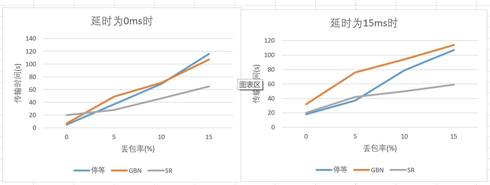

<h1><center>lab3-4实验报告</center></h1>
<center>姓名：吴静</center>
<center>学号：2113285</center>
<center>专业：信息安全</center>

**控制变量：**

```c++
const int MAXSIZE = 10240;
double MAX_TIME = CLOCKS_PER_SEC;
```

本次实验以`2.jpg`为测试文件。

## 一、停等机制与滑动窗口机制性能对比

### 1. 单一变量：丢包率

分别设置延时为0ms，5ms，10ms，15ms，在每个情况下设置丢包率分别为0%，5%，10%，15%，`GBN`和`SR`设置窗口大小为8，进行测试，得到图表如下：

- 纵坐标为传输时间

  - 柱状图

    

  - 折线图

    

- 纵坐标为吞吐率


分析如下：

- 观察柱状图，可以看出，在相同延时的情况下，低丢包率情况下，停等协议>`SR`>`GBN`；高丢包率情况下，`SR`的性能最好，`GBN`和停等协议的性能差不多，并且`GBN`的性能略微差于停等协议。
- 再观察折线图，发现随着丢包率上升，停等机制的传输时间上升速率大于`GBN`和`SR`的上升速率，推测随着丢包率上升，停等机制的性能下降的更快。

- Q：为什么`GBN`的总体效率表现不如停等协议？

  猜测：

  - 在该实验条件下传输速度主要取决于接收端的接受速度，在发送端发送数据后，接收端需要等待和停等协议接近相同的超时时间接收丢失的包，因此`GBN`和停等协议传输速度并没有相差多少，但是`GBN`使得接收端不得不处理失序的包，所以耽误了更多的时间。
  - 更大的窗口意味着更高的重传代价，将大大降低`GBN`性能

### 2. 单一变量：延时

分别设置延时为0ms，5ms，10ms，15ms，在每个情况下设置丢包率分别为0%，5%，10%，15%，`GBN`和`SR`设置窗口大小为8，进行测试，得到图表如下：

- 纵坐标为传输时间

  - 柱状图

    

  - 折线图

    

- 纵坐标为吞吐率

  

分析如下：

- 观察柱状图，可以看出，在丢包率相同时，除丢包率为0%的极端情况下，三者的性能始终是：`SR`>停等协议>`GBN`；同时三者随着延时的增加均处于稳定上升的趋势。

- 观察折线图，发现延时增加后，`GBN`的传输时间上升的最快。

- Q：理论上来说，停等机制需要每条消息单独等待时延和`RTT`，而窗口可以同时等待多条，那么不应该是`GBN`总体性能大于停等协议吗，为什么和图中所示数据不符？

  猜测：

  - 与“单一变量为丢包率”类似：在该实验条件下传输速度主要取决于接收端的接受速度，在发送端发送数据后，接收端需要等待和停等协议接近相同的超时时间接收丢失的包，因此`GBN`和停等协议传输速度并没有相差多少，但是`GBN`使得接收端不得不处理失序的包，所以耽误了更多的时间。

  - 在此条件下，`GBN`处理的包多于停等机制，同时每个包处理的时间增加，所以会导致`GBN`的效率大幅度降低。

### **总结**

1. `SR`的性能远大于`GBN`和停等机制
2. 理论上，`GBN`的性能大于停等机制，即滑动窗口机制比停等机制性能好。
   - 滑动窗口机制允许发送多条消息，同时等待对方回复的`ACK`，减少`RTT`的影响
   - 在有延时的情况下，`GBN`表现更好
     - 停等机制需要每条消息单独等待时延和`RTT`，而窗口可以同时等待多条
   - 丢包率大的时候，`GBN`效率低于停等机制
     - 更大的窗口意味着更高的重传代价，大大降低性能
3. 在本次实验中，遇上了“`GBN`实际性能低于停等机制”这一问题，原因可能是`GBN`的接收端需要处理更多的失序的包，导致时间被耽误的更多。

## 二、滑动窗口机制中不同窗口大小对性能的影响

由于窗口大小在网络情况不同时对滑动窗口机制性能的影响也不同，于是这里分成两种情况讨论：

- 网络情况较好时——延时0ms，丢包率0%
- 网络情况较差时——延时30ms，丢包率10%

### 1. 网络情况较好时

在丢包率为0%，延时为0ms的情况下进行实验。


分析如下：

- 在窗口大小由4增加到32的过程中，`GBN`和`SR`的传输时间和吞吐率变化都不大。

- Q：理论上来说，更大的窗口可以允许同时发送更多条消息并同时等待对方的`ACK`，减少等待的周期数，但是为什么在本次实验中随着窗口大小增加性能并没有明显提高？

  猜测：

  - 当窗口大小较大时，制约传输速度的因素主要是接收端接收的速度。如果接收端接收的速度快，发送端接收到`ACK`的时间变短，当前窗口大小长时间不到最大窗口大小，窗口大小的效用就不显著，因此单纯的增大窗口大小无益于增加传输速度，提高性能。
  - 本身将每个数据包的大小增加，数据包的个数减少，以本次实验为例，总共传输了576个数据包，结果不显著。

- 为什么本次实验中SR传输时间低于`GBN`？

  猜测：

  - 与`SR`的实现有关，由于`SR`在发生丢包时很容易造成数据包的反复重传，于是在发送端发送数据包之后增加了`Sleep(10)`的语句，导致发送端变慢。

### 2. 网络情况较差时

在丢包率为10%，延时为30ms的情况下进行实验。


分析如下：

- 在窗口大小由4增加到32的过程中，`SR`的传输时间有所降低，吞吐率不断升高；但是`GBN`的传输时间不断升高，吞吐率不断降低。

- Q：同为滑动窗口机制，为什么`GBN`和`SR`的性能变化趋势相反？

  猜测：与两者的原理不同：

  - `GBN`：在窗口内一个包超时后，窗口内的所有已发送未确认的包都要进行重传，所以当丢包率较高，或者超时时间过短时，大的窗口会增加重传代价，使效率降低
  - `SR`：窗口内每个包独立接受`ACK`，独立设置定时器，所以一个包超时重传并不会影响窗口内的其他包；相反，窗口大了，发送端能够发送的包增加，等待的周期数减少，性能增加。

### **总结**

1. 网络情况较好的时候，`GBN`和`SR`窗口大的效率更高
   - 更大的窗口可以允许同时发送更多条消息并同时等待对方的`ACK`，即减少等待的周期数，更好的应对时延问题
2. 网络情况较差时，`GBN`的效率随着窗口的增大而降低，`SR`的效率随着窗口的增大而增大
   - 与两者的实现原理不同：
     - `GBN`的窗口大时，丢包率较高会增加重传代价，效率降低
     - `SR`的窗口大时，发送端能够发送的数据增加，等待的周期数降低，效率增加

## 三、滑动窗口机制中相同窗口大小情况下，累计确认和选择确认的性能比较

考虑到不同窗口大小对累计确认和选择确认的性能影响不同，这里同样采用两个窗口大小：8和32

### 1. 窗口大小为8

原始数据：


为了防止另一个因变量对实验的影响，在控制变量进行分析时，取另一个变量为0的部分进行分析。

- 单一变量为“丢包率”

  控制延时为0ms：

  

- 单一变量为“延时”

  控制丢包率为0%：

  

分析如下：

- 延时为0ms或者丢包率为0%的情况下，`SR`效率低于`GBN`，这是由于`Sleep(10)`影响，与本身性能无关，于是舍弃不看。
- 在其他几种情况下，`SR`性能均明显优于`GBN`
- 从变化趋势来看：
  - 延时相同的情况下，随着丢包率上升，`GBN`的传输时间和吞吐率的变化明显大于`SR`，故`GBN`被丢包率的影响大于`SR`被丢包率的影响
  - 丢包率相同的情况下，随着延时的上升，`GBN`的传输时间和吞吐率的变化与`SR`大致相当，略小于`SR`的变化趋势，故`SR`被延时的影响略大于`GBN`被延时的影响

### 2. 窗口大小为32

- 单一变量为“丢包率”

  控制延时为0ms：

  

- 单一变量为“延时”

  控制丢包率为0%：

  

分析如下：

- 延时为0ms或者丢包率为0%的情况下，`SR`效率低于`GBN`，这是由于`Sleep(10)`影响，与本身性能无关，于是舍弃不看。
- 在其他几种情况下，`SR`性能均明显优于`GBN`
- 从变化趋势来看：
  - 延时相同的情况下，随着丢包率上升，`GBN`的传输时间和吞吐率的变化明显大于`SR`，故`GBN`被丢包率的影响大于`SR`被丢包率的影响
  - 丢包率相同的情况下，随着延时的上升，`GBN`的传输时间和吞吐率的变化与`SR`大致相当，略小于`SR`的变化趋势，故`SR`被延时的影响略大于`GBN`被延时的影响
- 结合两种窗口大小的各项数据，可以发现，即使窗口大小不同，但是`GBN`和`SR`随着延时和丢包率的变化趋势大致相同。

### **总结**

1. 相同窗口大小情况下，累计确认性能低于选择确认
2. 相同窗口大小情况下，累计确认被“丢包率”影响大于选择确认，被“延时”影响略小于选择确认。